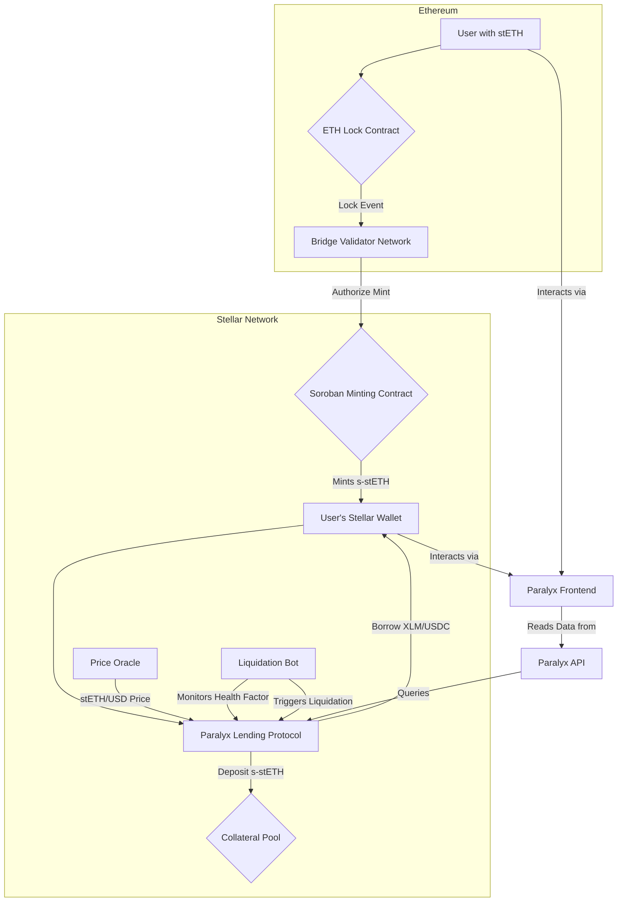

# Paralyx Protocol: A Cross-Chain LSD Collateral Platform on Stellar
-------
<div align="center">
  
</div>

[](https://www.google.com/search?q=https://github.com/paralyx-LSD/paralyx-protocol)
[](https://opensource.org/licenses/MIT)
[](https://www.stellar.org/)
[](https://soroban.stellar.org/)


Paralyx Protocol is a decentralized, non-custodial lending market built on the Stellar network. It unlocks the potential of Ethereum's Liquid Staking Derivatives (LSDs) by bridging them to Stellar's high-speed, low-cost infrastructure, creating a new layer of liquidity and utility for both ecosystems.

## Table of Contents

1.  [The Problem](https://www.google.com/search?q=%231-the-problem)
2.  [The Solution: Paralyx Protocol](https://www.google.com/search?q=%232-the-solution-paralyx-protocol)
3.  [Core Features](https://www.google.com/search?q=%233-core-features)
4.  [Technical Architecture](https://www.google.com/search?q=%234-technical-architecture)
      - [System Flow Diagram](https://www.google.com/search?q=%23system-flow-diagram)
      - [Component Breakdown](https://www.google.com/search?q=%23component-breakdown)
5.  [Repository Breakdown](https://www.google.com/search?q=%235-repository-breakdown)
      - [`paralyx-protocol`](https://www.google.com/search?q=%23paralyx-protocol)
      - [`paralyx-bridge`](https://www.google.com/search?q=%23paralyx-bridge)
      - [`paralyx-api`](https://www.google.com/search?q=%23paralyx-api)
      - [`paralyx-frontend`](https://www.google.com/search?q=%23paralyx-frontend)
6.  [Hackathon Deliverables](https://www.google.com/search?q=%236-hackathon-deliverables)
7.  [Getting Started (Local Development)](https://www.google.com/search?q=%237-getting-started-local-development)
8.  [Future Roadmap](https://www.google.com/search?q=%238-future-roadmap)

-----

## 1\. The Problem

The Ethereum network secures over **$40+ billion** in Liquid Staking Derivatives (LSDs) such as stETH (Lido Staked Ether), rETH (Rocket Pool ETH), and cbETH (Coinbase Wrapped Staked ETH). These are powerful, yield-bearing assets. However, their utility is largely confined to the Ethereum ecosystem, which can be subject to high transaction fees and network congestion.

Simultaneously, the **Stellar network**, known for its speed, low cost, and scalability, lacks a native protocol that can harness these premier yield-bearing assets as collateral. This represents a significant missed opportunity to introduce high-quality liquidity and expand the DeFi capabilities within the Stellar ecosystem.

## 2\. The Solution: Paralyx Protocol

**Paralyx Protocol** directly addresses this gap by creating a secure and efficient bridge to transfer Ethereum-based LSDs to the Stellar network. Once bridged, these assets can be used as collateral within paralyx's native lending market.

This solution achieves two primary goals:

  * **For Ethereum Users**: It provides a new avenue to utilize their LSDs, allowing them to borrow against their holdings in a low-cost environment without selling their underlying staked assets.
  * **For the Stellar Ecosystem**: It introduces a substantial new liquidity layer, attracts capital from the Ethereum ecosystem, and enables the creation of more sophisticated financial products on Stellar.

## 3\. Core Features

  * **Cross-Chain Bridging**: Securely wraps and transfers Ethereum LSDs to Stellar as 1:1 backed tokens (e.g., stETH becomes s-stETH).
  * **Over-Collateralized Lending**: Users can supply their bridged LSDs as collateral to borrow native Stellar assets (like XLM, USDC).
  * **Dynamic Interest Rates**: Interest rates for borrowing and lending are determined algorithmically based on the supply and demand (utilization rate) of each asset pool.
  * **Real-Time Price Oracles**: Integrated oracles provide reliable, real-time price feeds for all assets to ensure accurate valuation of collateral and debt.
  * **Automated Liquidation System**: A robust system protects the protocol's solvency by automatically liquidating under-collateralized positions.
  * **User-Friendly Interface**: A clean web interface for users to easily manage their deposits, loans, and view protocol statistics.

## 4\. Technical Architecture

Paralyx is a multi-component system designed for security, reliability, and efficiency.

### System Flow Diagram



### Component Breakdown

1.  **Cross-Chain Bridge**: This is a lock-and-mint bridge.

      * **Locking**: A user deposits their stETH into a smart contract on the Ethereum network.
      * **Validation**: A decentralized network of off-chain validators listens for `AssetLocked` events from the Ethereum contract.
      * **Minting**: Upon consensus, the validators authorize the minting of a corresponding amount of a wrapped token (e.g., `s-stETH`) on the Stellar network to the user's Stellar wallet. The reverse process (burn-and-release) allows users to redeem their original stETH.

2.  **Collateral Engine (Lending Core)**: This is the heart of the protocol, built with **Soroban smart contracts** on Stellar.

      * It manages asset pools, handles user deposits (supplying liquidity), and processes borrow requests.
      * It enforces an **over-collateralized** model, requiring users to supply collateral worth more than their loan. The initial Loan-to-Value (LTV) ratio is set between 60-70%, meaning a user can borrow up to $60-$70 worth of assets for every $100 of collateral supplied.

3.  **Price Oracle**: To value collateral and debt accurately, the protocol integrates a Soroban-based price oracle. This oracle fetches price feeds (e.g., stETH/USD, XLM/USD) from multiple reliable on-chain and off-chain sources to provide a tamper-resistant, time-weighted average price (TWAP).

4.  **Liquidation System**: This is a critical risk management component.

      * An off-chain **liquidation bot** constantly monitors the health of all loans.
      * If an account's LTV rises above a liquidation threshold (e.g., 80%) due to market fluctuations, the position becomes eligible for liquidation.
      * A liquidator can then repay a portion of the user's debt in exchange for their collateral at a discount, bringing the protocol back to solvency and earning a fee.

5.  **Interest Rate Model**: The protocol uses a dynamic interest rate model based on an asset's **utilization rate** (the percentage of supplied assets that are currently being borrowed).

      * *Low Utilization* -\> Low interest rates to encourage borrowing.
      * *High Utilization* -\> High interest rates to encourage new supply and loan repayments.

## 5\. Repository Breakdown

The Paralyx Protocol codebase is organized into four main repositories.

### `paralyx-protocol`

This repository contains the core on-chain logic of the lending market.

  * **Contents**:
      * `/contracts`: All Soroban smart contracts written in Rust.
          * `LendingPool.rs`: The main contract that orchestrates deposits, borrows, and repayments.
          * `sToken.rs`: The implementation of the interest-bearing token that users receive when they deposit assets.
          * `PriceOracle.rs`: The contract interface for retrieving asset prices.
          * `LiquidationManager.rs`: Logic for handling the liquidation of unhealthy positions.
          * `Config.rs`: Contract for setting and managing protocol parameters like LTV ratios and liquidation thresholds.
      * `/tests`: Integration and unit tests for the smart contracts.
      * `/scripts`: Deployment and interaction scripts.

### `paralyx-bridge`

This repository contains all components required for the cross-chain transfer of assets between Ethereum and Stellar.

  * **Contents**:
      * `/ethereum`: Solidity smart contracts for the Ethereum side of the bridge.
          * `LSDLockbox.sol`: The contract where users lock their ERC20-based LSDs (e.g., stETH).
      * `/validator-node`: The off-chain application for bridge validators.
          * `eth-listener.js`: A service that listens for events on the `LSDLockbox.sol` contract.
          * `stellar-minter.js`: A service that, upon consensus, submits transactions to the Stellar network to mint/burn wrapped assets.
      * `/docs`: Bridge architecture and security documentation.

### `paralyx-api`

This repository contains a backend API service that acts as a middleware between the frontend and the blockchain, providing indexed and aggregated data for a better user experience.

  * **Contents**:
      * `/src`: The source code for the API server (likely built with Node.js/Express or Golang).
          * `/routes`: API endpoints (e.g., `/user/:walletAddress`, `/protocol/stats`).
          * `/services`: Logic for fetching and caching data from the Stellar network (using Horizon and Soroban RPC) and calculating derived stats (e.g., APYs, user health factors).
          * `/database`: Optional database schemas for caching historical data.
      * `Dockerfile`: For containerizing the API service.

### `paralyx-frontend`

This repository contains the user-facing web application.

  * **Contents**:
      * `/src`: The source code for the React/Next.js application.
          * `/components`: Reusable UI components (e.g., `ConnectWalletButton`, `DepositModal`, `Dashboard`).
          * `/pages`: The different views of the application (e.g., Dashboard, Markets, Governance).
          * `/hooks`: Custom React hooks for interacting with the blockchain and the `paralyx-api` (e.g., `useUserPosition`, `useMarketData`).
          * `/utils`: Helper functions for formatting numbers, interacting with wallets (Freighter, MetaMask), etc.
      * `package.json`: Project dependencies and scripts.

## 6\. Hackathon Deliverables

This project was initiated as part of a hackathon. The following Minimum Viable Product (MVP) components were delivered:

 **Stellar Smart Contracts**: Core lending and borrowing logic implemented in Rust with Soroban.
 **Soroban-based Price Oracle Integration**: Basic integration to fetch and use asset prices.
 **Web Interface**: A functional frontend to deposit, borrow, and manage positions.
 **MVP Bridge Mechanism**: A proof-of-concept bridge running on testnet to demonstrate cross-chain functionality.
 **Liquidation Bot Prototype**: A basic off-chain script to monitor and flag positions eligible for liquidation.
parallax
## 7\. Getting Started (Local Development)

To run a local instance of the Paralyx Protocol for development:

1.  **Prerequisites**:

      * Rust & Cargo
      * Soroban CLI
      * Node.js & npm
      * Docker
      * Freighter Wallet (for browser interaction)

2.  **Clone Repositories**:

    ```bash
    git clone https://github.com/example/paralyx-protocol.git
    git clone https://github.com/example/paralyx-api.git
    git clone https://github.com/example/paralyx-frontend.git
    ```

3.  **Setup Backend**:

      * Navigate to the `paralyx-protocol` directory.
      * Compile and deploy contracts to a local Soroban network following the instructions in its README.

4.  **Run Services**:

      * In the `paralyx-api` directory, run `npm install` and `npm start`.
      * In the `paralyx-frontend` directory, run `npm install` and `npm run dev`.

5.  **Interact**: Open your browser to `http://localhost:3000` to interact with the protocol.

## 8\. Future Roadmap

  * **Q3 2025**: Mainnet launch on Stellar. Auditing of all smart contracts and bridge components.
  * **Q4 2025**: Addition of more LSDs (rETH, cbETH) and other yield-bearing assets.
  * **Q1 2026**: Introduction of a governance token and establishment of the paralyx DAO for decentralized protocol management.
  * **Q2 2026**: Exploration of flash loans and other advanced DeFi features.